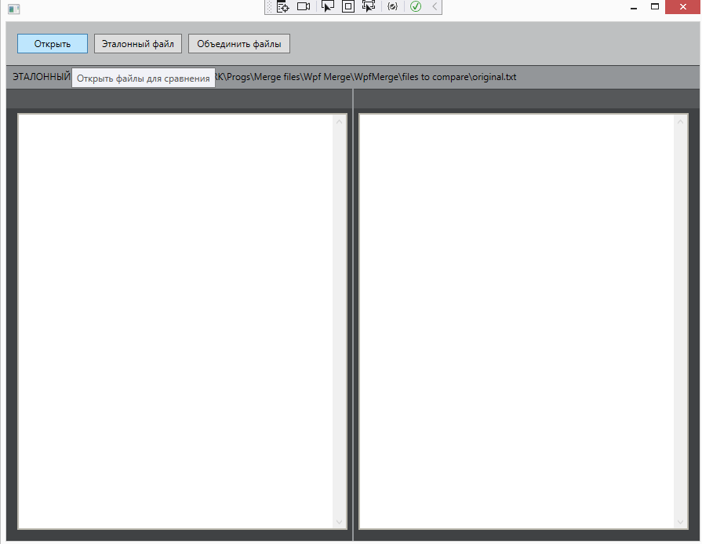

# WpfMerge
WPF application to compare changes in two files and original file.
You can merge the changes of both files into one.

Приложение с использованием технологии WPF для отслеживания изменений в двух файлах на основании эталонного файла.
После чего можно объединить изменения из двух этих файлов.

## Installing
You can download the latest release and run it.

## Usage
You need to select the source (original) file and the two revised files (after editing) you want to compare.

Click the OK button and app will immediately show tracked changes between the original and revised documents. 

You can merge the changes of both files into one.

